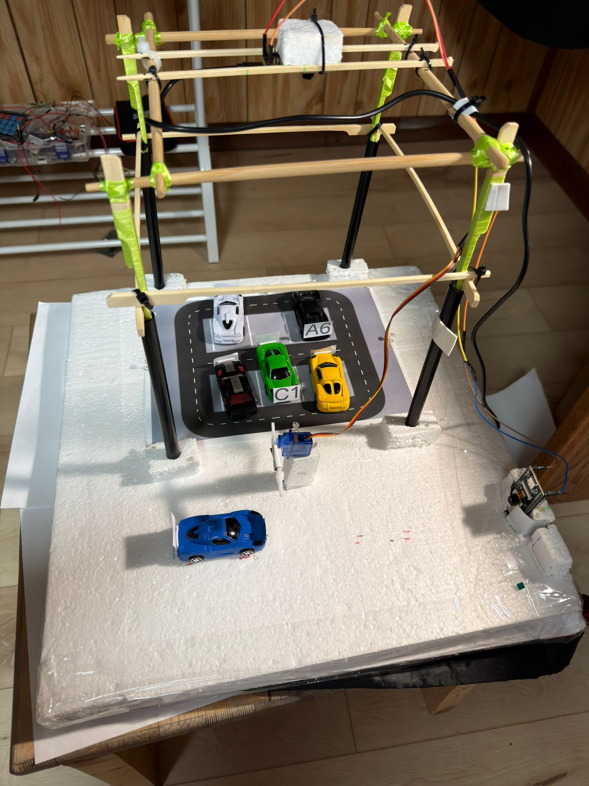
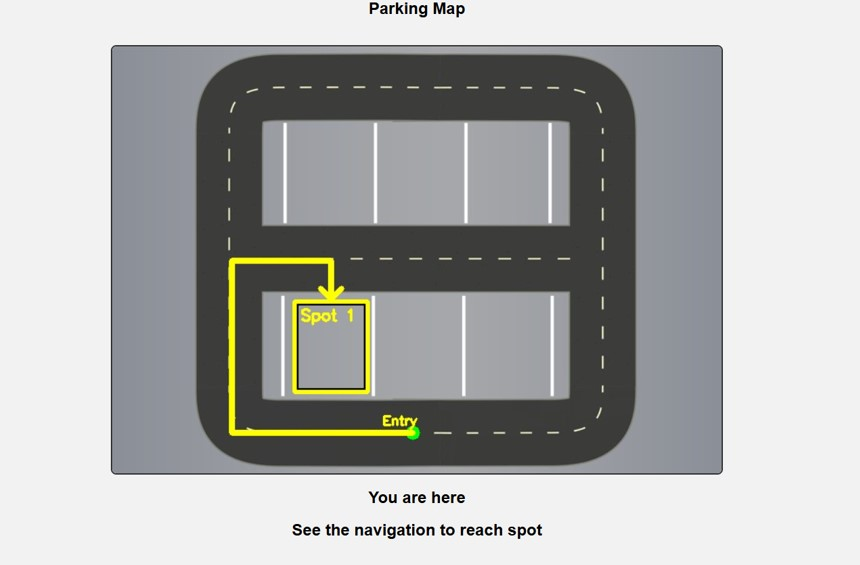
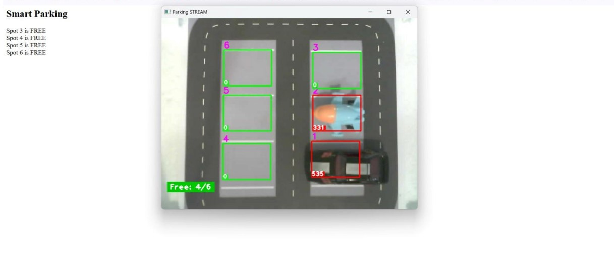
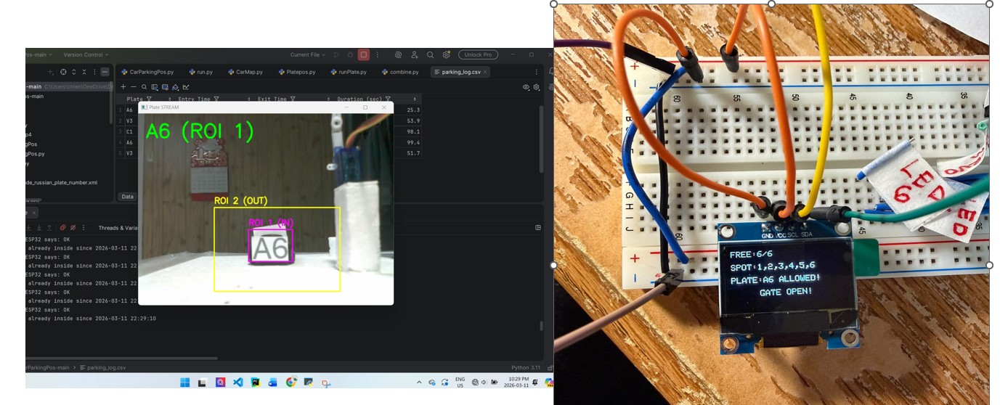

# Advanced Smart Parking System

A real-time embedded IoT parking system with computer vision, automated gate control, and nearest spot navigation.

## Demo

<h2><strong>🎬 DEMO VIDEO</strong></h2>

<strong>Watch the full system demo by clicking the thumbnail below:</strong>

  

### System Overview

### Web Interface

### Parking Detection

### OLED Display and Plate Detection

## Overview
This project integrates ESP32, ESP32-CAM, Python, OpenCV, and OCR to detect parking occupancy, recognize license plates, control gate access, and provide parking status through an OLED display, web interface, and vehicle entry/exit logging system.

## Features
- Real-time parking space detection
- License plate recognition using OCR
- Automated gate control with servo motor
- OLED display for parking and vehicle status
- Browser-based monitoring interface
- Nearest available parking spot navigation
- Vehicle entry and exit logging
- ESP32 and ESP32-CAM integration
- HTTP-based communication between vision system and controller

## Technologies Used
- C / C++
- Python
- ESP32 / ESP32-CAM
- OpenCV
- Tesseract OCR
- HTML / CSS
- I2C, PWM, GPIO, Interrupts

## Project Structure
- `esp32/` – ESP32 and ESP32-CAM firmware
- `openCv/` – Python scripts for parking detection and plate recognition

## How It Works
1. ESP32-CAM streams video to the vision system.
2. Python with OpenCV processes parking occupancy.
3. OCR detects license plate information.
4. Vehicle entry and exit data are logged during system operation.
5. ESP32 receives data through HTTP requests.
6. Gate, LEDs, OLED, and web interface update in real time.

## Future Improvements
- Cloud-based monitoring
- Improved navigation interface
- Higher accuracy plate recognition

## Author
Colin Nguyen
